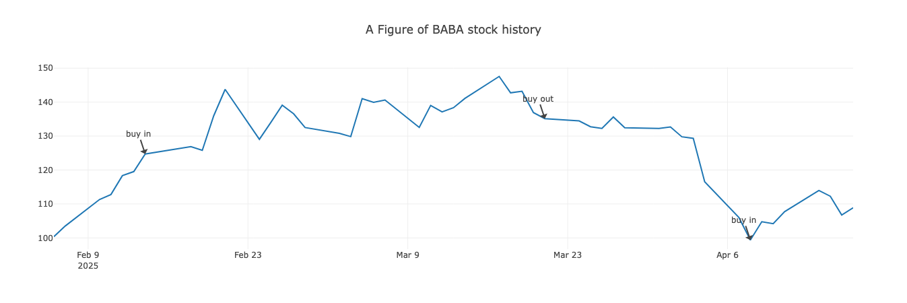
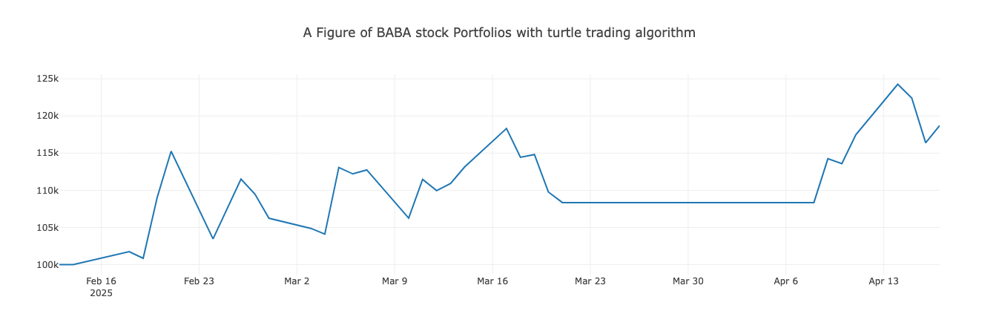

# Quantgo
A Quantitative Trading System.

# Example

1.Query the stock price of Apple Inc. in the past 100 days and plot it。

```
 ./quantgo-cli plot_stock_chart -c AAPL -d 100
```


2.Quantitative investment decision-making of Alibaba stock using turtle trading algorithm。

```
./quantgo-cli quant_cal -a turtle -c BABA -d 50
```






